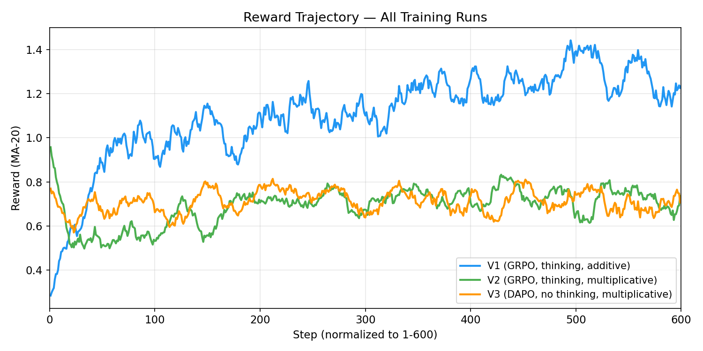
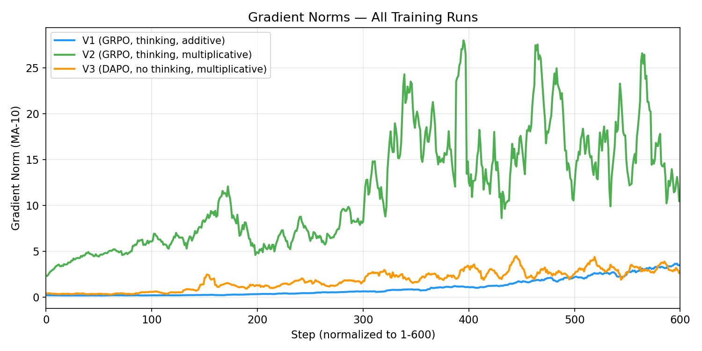
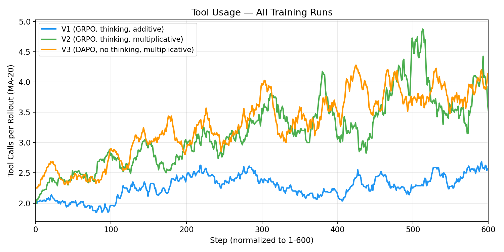

# Agent Gym

Teaching a language model to search the web through reinforcement learning — no supervised fine-tuning on tool-use demonstrations.

## Motivation

This is an experimentation and learning project exploring **RL for agentic tool use**. Inspired by the [SID-1 Technical Report](https://www.sid.ai/research/sid-1-technical-report), which showed that GRPO alone can teach models effective web search behavior. The core idea: reward *what was found*, not *how to search* — the model discovers search strategies on its own.

We wanted to understand firsthand how reward design, token-space training, thinking control, and off-policy architectures interact in practice. Every design choice in this repo was arrived at through experimentation, and the [technical report](REPORT.md) documents the full journey including what failed and why.

## What It Does

A Qwen3-14B model learns three tools via RL:

- **`search(query)`** — web search, returns snippets tagged `[S1]`, `[S2]`, etc.
- **`read(url, keywords)`** — reads a page, returns matching paragraphs tagged `[R1]`, `[R2]`, etc.
- **`submit_answer(passage_ids)`** — submits retrieved passages as the final answer

The model learns when to search, when to read for more detail, and when to submit — all from reward signal alone.

## Results

| Model | Submit Rate | Judge Score | vs Gold |
|-------|-----------|-------------|---------|
| Base Qwen3-14B | 55% | 0.450 | 50% |
| **Best (V2 CP-1200)** | **91%** | **0.655** | **73%** |
| Gold passages | 100% | 0.895 | 100% |

**2.25x improvement** over base model. The trained model reliably searches the web, reads pages, and submits relevant passages on 22 questions about 2025-2026 events it cannot answer from memory.

## Key Findings

1. **Multiplicative rewards beat additive.** `reward = judge × format × thinking` prevents the model from gaming one component to compensate for another. We discovered this naturally and later found backing in the [GR³ paper](https://arxiv.org/abs/2603.10535).

2. **LLM-as-a-judge replaces complex scoring pipelines.** A single GPT 4.1 mini call (~$0.001/rollout) replaced FAISS embeddings + NDCG + cross-encoders — and worked better, especially for multi-hop questions.

3. **Token-space tool calling (TI/TO) matters.** Staying in token space during multi-turn tool calling avoids the byte-to-token mismatches that [SID-1 found cause training instability](https://www.sid.ai/research/sid-1-technical-report).

4. **Thinking helps tool-use decisions but costs 4-5x latency.** Disabling `<think>` blocks dropped submit rate from 91% to 59%, but reduced inference latency from 15s to 3.3s per query (2-iteration). Crucially, V3's low scores are driven by format failures (invalid tool-call syntax), not degraded reasoning — on the 11 questions where both V2 and V3 submitted, they score identically (0.793 vs 0.798) — though this subset skews ~45% 1-hop questions, so parity on harder multi-hop needs further validation. An SFT warmup phase to teach format before RL is the most promising fix.

5. **Prompt engineering provides significant lift even after RL.** Improved tool descriptions raised CP-600's submit rate from 55% to 82% without additional training.

## Architecture

```
Single-GPU Training (V2/V3):
┌──────────────────────────────────────────────────┐
│  TiToGRPOTrainer (single RTX PRO 6000 WS, 96GB)    │
│                                                   │
│  Generate → Tool Call Loop (TI/TO) → Reward       │
│     │            │                      │         │
│     │      search/read/submit     LLM Judge       │
│     │      (web APIs)           (GPT 4.1 mini)    │
│     │                                   │         │
│     └──── GRPO/DAPO loss ◄──────────────┘         │
│           × format_scale × thinking_scale         │
└──────────────────────────────────────────────────┘

Off-Policy Training (OLMo-3 style, 2-GPU):
┌─────────────────┐     ┌──────────────────┐
│  GPU 0: Actor    │────▶│  GPU 1: Learner  │
│  Rollout Server  │◀────│  GRPO Trainer    │
│  (async TI/TO)   │     │  (LoRA updates)  │
└─────────────────┘     └──────────────────┘
```

## Training Runs

Three training runs explored different configurations:

| Run | Steps | Loss | Thinking | Reward | Best Judge |
|-----|-------|------|----------|--------|-----------|
| V1 | 1-600 | GRPO | Enabled | Additive (judge+efficiency+format) | 0.587* |
| **V2** | **600-1200** | **GRPO** | **Enabled** | **Multiplicative (judge×format×thinking)** | **0.655** |
| V3 | 1-600 | DAPO | Disabled | Multiplicative | 0.485 |

*V1 CP-600 evaluated with improved prompt (original prompt scored 0.450, same as base).

Training dynamics across all three runs:





## Project Structure

```
src/
├── training/
│   ├── train.py              # Main training entry point
│   ├── tito_trainer.py       # TI/TO GRPO trainer (single-GPU)
│   ├── tito.py               # Token-space tool calling primitives
│   ├── thinking_budget.py    # LogitsProcessor for thinking control
│   ├── rollout_server.py     # Async rollout server (off-policy, GPU 0)
│   ├── offpolicy_trainer.py  # Off-policy trainer (GPU 1)
│   └── configs/              # Training YAML configs
├── env/
│   ├── search_env.py         # Base search environment
│   └── search_env_v2.py      # V2 with snippet IDs + submit_answer
├── rewards/
│   ├── llm_judge_reward.py   # GPT 4.1 mini judge (primary reward)
│   ├── format_reward.py      # Snippet ID validation (multiplicative scaler)
│   └── thinking_reward.py    # Thinking length penalty (multiplicative scaler)
└── utils/
scripts/
├── run_eval_completions.py   # Evaluation with tool forcing
├── visualize_training.py     # Plotly training dashboards
├── train_offpolicy.py        # Off-policy 2-GPU launcher
├── generate_data_v2.py       # Training data generation
└── prep_dataset_v2.py        # Dataset formatting for TRL
```

## Quick Start

```bash
# Install
pip install trl peft datasets pyyaml fastapi uvicorn duckduckgo-search trafilatura rapidfuzz openai

# Set API keys
cp .env.example .env  # add your OPENAI_API_KEY

# Train (single GPU)
python -m src.training.train --config src/training/configs/cloud_14b_v3_nothink.yaml

# Evaluate
python scripts/run_eval_completions.py \
    --checkpoint checkpoints/v3-cp600 \
    --eval-data data/eval_trl_v2.jsonl \
    --output results/eval.json \
    --disable-thinking
```

## Future Work

- **Solve no-thinking submit rate** — V3's 4-5x latency advantage makes no-thinking highly desirable for production. The 59% submit rate is driven by format failures (invalid tool-call syntax), not reasoning quality — submitted questions score 0.820. Most promising fix: a short SFT warmup (~50-100 steps) on tool-call format demonstrations before RL ([R1-Searcher++](https://arxiv.org/abs/2505.17005) validates this approach), combined with a format reward floor (`max(format_scale, 0.01)`) to prevent vanishing gradients on format-invalid trajectories ([PRS](https://arxiv.org/abs/2512.07478)).
- **Re-enable thinking with DAPO** — As a baseline comparison, combine thinking + DAPO + temp annealing for V4 to isolate whether DAPO or no-thinking caused V3's lower eval scores.
- **Partial credit for intermediate hops** — GRPO is trajectory-level; per-hop credit assignment ([MT-GRPO](https://arxiv.org/abs/2505.11821)) could improve multi-hop learning.
- **Off-policy scaling** — Our OLMo-3-style async architecture is validated; scale to multiple actors with [OAPL](https://arxiv.org/abs/2603.10535) for principled staleness management.
- **SPEC-RL** — [Speculative decoding for RL](https://arxiv.org/abs/2509.23232) promises 2.88x speedup with zero extra VRAM.
- **SGLang backend** — Replace plain transformers generation with [SGLang](https://github.com/sgl-project/sglang) for 29% throughput improvement. No version conflicts (unlike vLLM).
- **veRL migration** — [veRL](https://github.com/volcengine/verl) natively supports GRPO + multi-turn tool calling via SGLang. Cleaner long-term architecture.
- **Vanishing gradient floor** — Add `max(format_scale, 0.01)` to maintain gradient signal on fully invalid submissions.

## References

| Paper | Role |
|-------|------|
| [SID-1](https://www.sid.ai/research/sid-1-technical-report) | Primary inspiration — RL for web search, TI/TO |
| [GRPO](https://arxiv.org/abs/2402.03300) | Base RL algorithm |
| [DAPO](https://arxiv.org/abs/2503.14476) | Token-level loss, dynamic sampling |
| [GR³](https://arxiv.org/abs/2603.10535) | Multiplicative reward design |
| [OLMo-3](https://arxiv.org/abs/2512.13961) | Off-policy GRPO, PipelineRL |
| [Search-R1](https://arxiv.org/abs/2503.09516) | RL for search-augmented reasoning |
| [R1-Searcher++](https://arxiv.org/abs/2505.17005) | SFT cold-start + RL for search |
| [PRS](https://arxiv.org/abs/2512.07478) | Progressive reward shaping for agentic RL |

## Cost

Total project cost: **~$92** (data generation + 3 training runs + eval + debugging on Vast.ai).

---

For the full development journey — reward design iterations, bugs, optimizations, and lessons learned — see the [Technical Report](REPORT.md).
